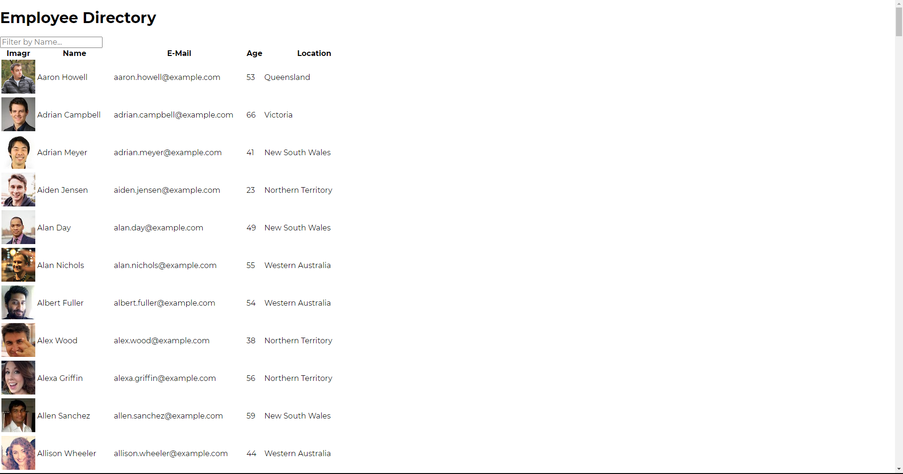

# Employee Directory

* [How it works](#work)
* [Install](#install)
* [Credits](#credits)
* [License](#license)
# How it works 
Keeping track of employees and be able to easily find the employee you are looking for
## Install
Clone the repo or go to this link to use it https://elijahig.github.io/employee-directory/
## Instructions
Enter the name of an employee and the list will filter to only employees that match those credentials 
## Credits
Elijah Davis
## License 
N/A
## Reporting issues and making contributions 
Report issues on this git repo
# Contact
* Github :ElijahIG
* E-mail :elijahgdavis1999@gmail.com

## Screenshots
